# KamaClaude

我最近在公众号「卡码大模型」上，更新了很多关于 Agent、codex、Claude工作原理的文章。

这些文章目前已经沉淀在卡码笔记上：[https://notes.kamacoder.com](https://notes.kamacoder.com)

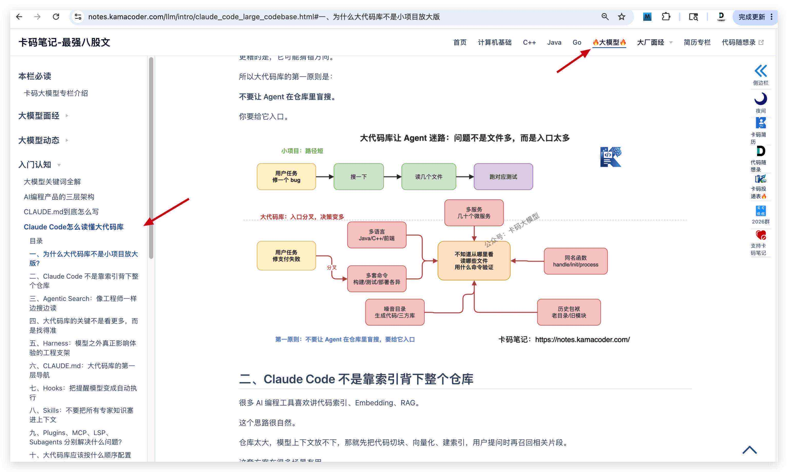

很多录友反馈：

卡哥，我看了很多文章，也知道 Agent Loop、ReAct、Tool Use、MCP 这些词，但总感觉隔了一层。

很多概念还停留在“知道名词”的阶段。

现在大家找工作。无论你是哪个方向，现在都需要有一个Agent项目。

Agent 这个东西，光看文章还不够。

你得自己实现一个最小版本，亲手把用户输入、拆解任务、loop、工具调用、事件流、权限审批、上下文管理这些链路串起来，才会真正理解：

**所谓 AI Agent，到底是怎么跑起来的。**

目前市面上，哪里那个Agent做的最好，当然是Claude。

所以这次我在知识星球里更新一个新的 AI Agent 项目：

**KamaClaude：从零实现一个本地 Claude Code Agent 系统（mini 版）。**

也可以理解为：我们自己动手实现一个 **minClaude**，不仅实现Agent内核，还是先一套 TUI。

大家可以看一下效果：（接入的是deepseek-v4-flash，当然大家也可以接入其他模型）。

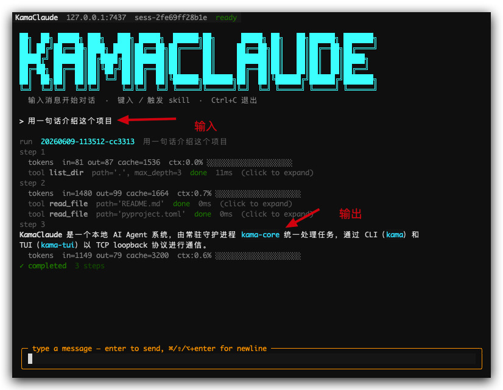

可以接入命令，可以使用skill，可控制上下文，可压缩：


可以下达一个稍稍负责的任务，KamaClaude自动完成规划 并执行：

（KamaClaude会先申请一下本地编辑权限）

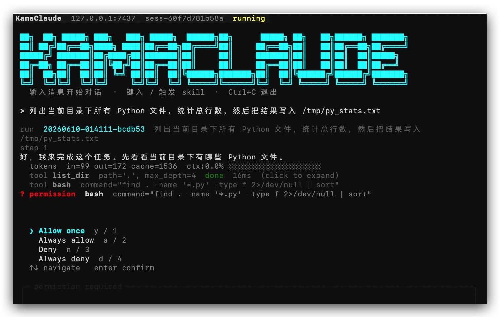

然后规划并执行：

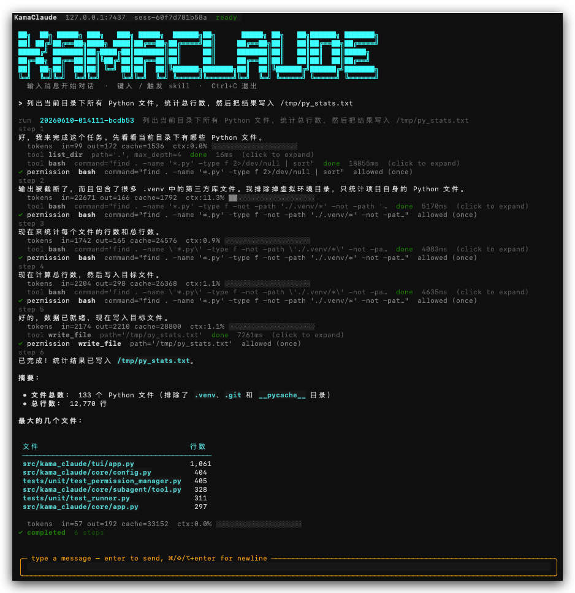

当然，它不是要一比一复刻 Claude Code 的所有产品能力，而是把 Claude Code 这类 AI 编程 Agent 最核心的运行机制拆出来：

* 用户输入一个目标，Agent 能自己规划下一步
* 模型不是只回答文本，而是能主动发起工具调用
* 工具调用不是直接裸跑，而是有参数校验和权限审批
* 执行过程不是黑盒，而是通过事件流实时展示到 TUI
* 每一次 run 都能留下 events、trace、session 记录，方便复盘和排查
* 多轮会话不是简单拼接历史，而是有 thread、notes、context 分层记忆
* 上下文快爆了，不是粗暴截断，而是有水位检测和 compact 压缩
* 复杂任务可以交给子 Agent，外部工具可以通过 MCP 接进来

我们要做的是一个真正能跑任务、能调工具、能看过程、能管权限、能续上下文、能扩展生态的本地 Agent 运行时。

你学完之后，再看 Claude Code、Codex、Cursor 这些 AI 编程工具，就不会只停留在“它好像很智能”。

你能看懂它背后那条工程主线：

**用户目标 → Agent Loop → 模型思考 → 工具调用 → 结果回填 → 事件展示 → 会话续航。**

### 项目演示

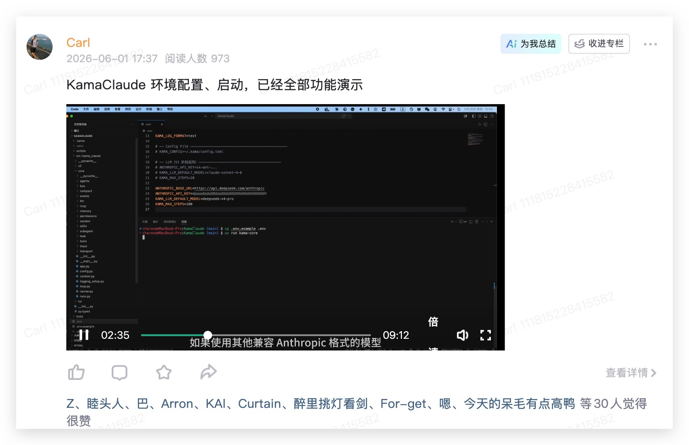

本视频只在[知识星球](https://programmercarl.com/other/kstar.html)里，带大家演示如何从零运行 KamaClaude，并完成一次完整的 Agent 使用体验：

* 克隆项目和切换阶段分支
* 配置 `.env`
* 让 Agent 写一个一个任务
* 配置 Skill 和 MCP
* 在 TUI 里看到工具调用、事件流、权限审批和上下文水位

### KamaClaude 长什么样？

KamaClaude 的最终形态是这样的：

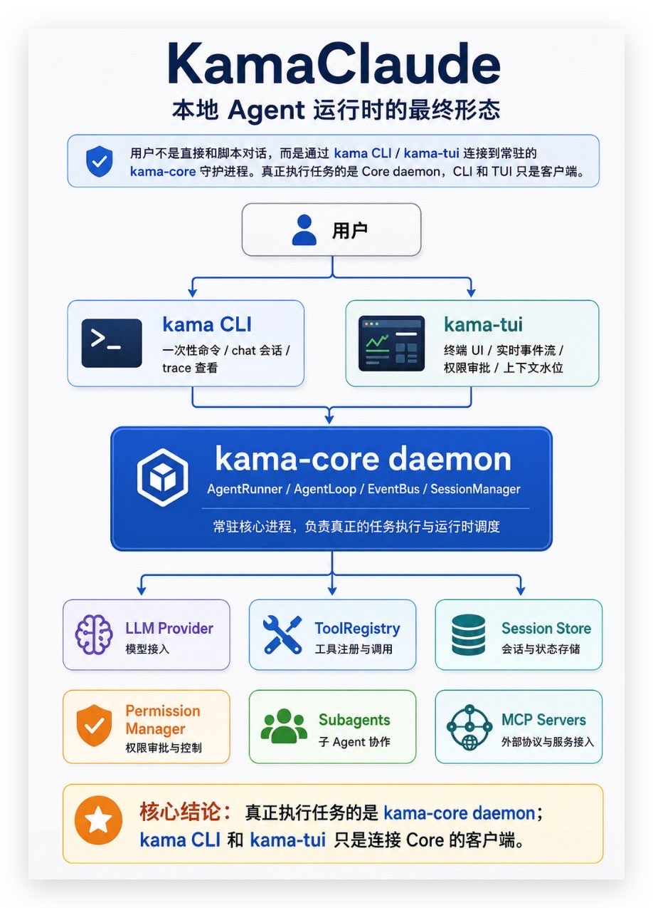

用户不是直接和一个脚本对话，而是通过 `kama` CLI 或 `kama-tui` 连接到常驻的 `kama-core` 守护进程。

真正执行任务的是 Core daemon。

CLI 和 TUI 只是客户端。

这意味着：

* TUI 崩了，Agent 任务不一定要跟着死
* 后续可以同时接 CLI、TUI、Web 前端
* 所有任务过程都能通过事件流订阅
* 所有命令、响应、事件都要通过类型化协议通信
* Agent 的工具调用、会话记忆、权限审批、上下文压缩，都在同一条运行链路里完成

这就是它和普通 AI Demo 最大的区别：

**普通 Demo 是“调用模型”。KamaClaude 是“搭一个本地 Agent 运行时”。**

### 项目专栏目录

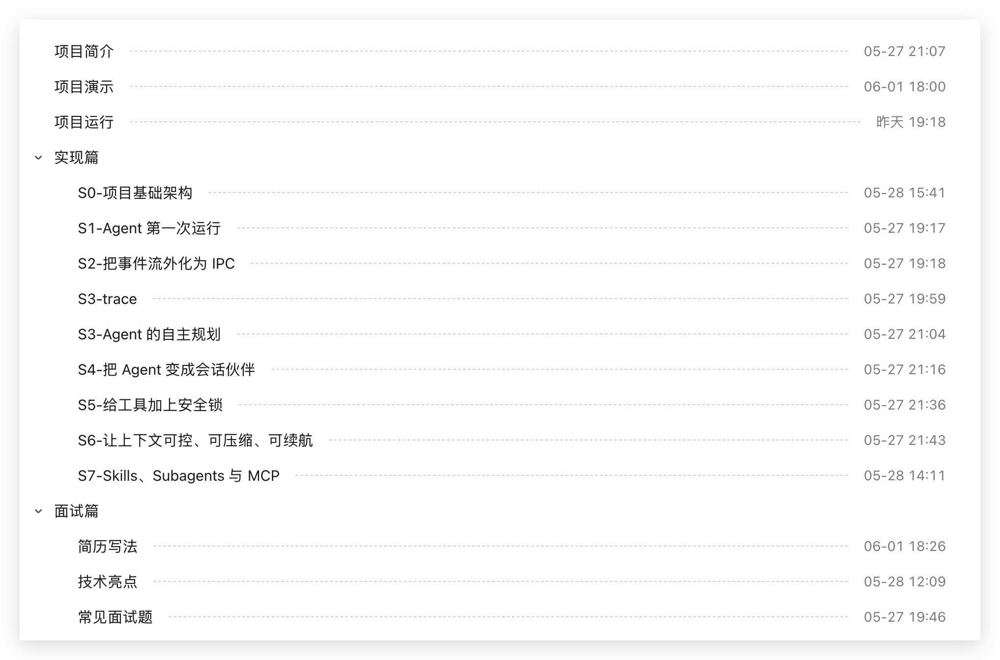

从项目演示，运行到 项目实战：架构如何设计、环境怎么搭，Agent loop，上下文、可压缩、MCP、skill支持这些如恶化设计。

最后再到求职相关：项目的简历写法、项目亮点、本项目常见面试题，都给大家准备好了。

从**项目源码到答疑，一条龙服务，不用担心学不会，有什么问题都可以在专属微信群提问**：（[知识星球](https://programmercarl.com/other/kstar.html)里每个项目都有专属答疑群）

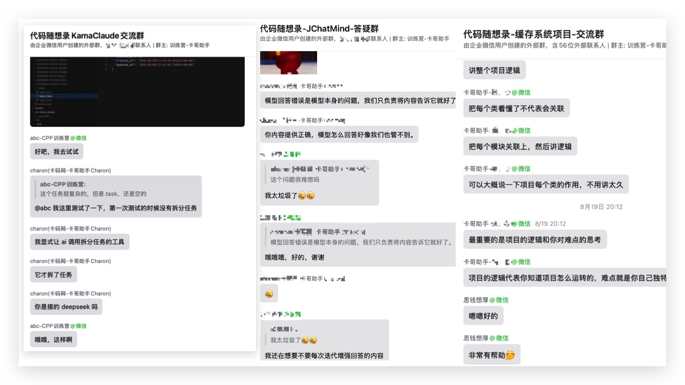

扫如下十元代金券，只需要 196 元，加入[知识星球](https://programmercarl.com/other/kstar.html)，你将获得 **20+ 套项目教程专栏 + 源码 + 配套答疑**。

每个项目平均不到十元钱，而且加入星球的服务远不止这些项目。

<div align="center"> </img></div>

加入知识星球后，记得加如下微信，发动付款截图，拉你到星球交流群：

<div align="center"> </img></div>

如果你不知道知识星球对自己是否有帮助，可以先加入看看，感受一下星球里的学习氛围。

**三天内（72h）可以全额退款。**

### 项目特色

这个项目，我采用全新的讲解方式，不是一下子直接给大家全部项目代码。

而且分成了 8个阶段，一步一步，带大家实现完整的kamaClaude。

每个阶段都不是堆功能，而是解决一个真实的 Agent 工程问题。

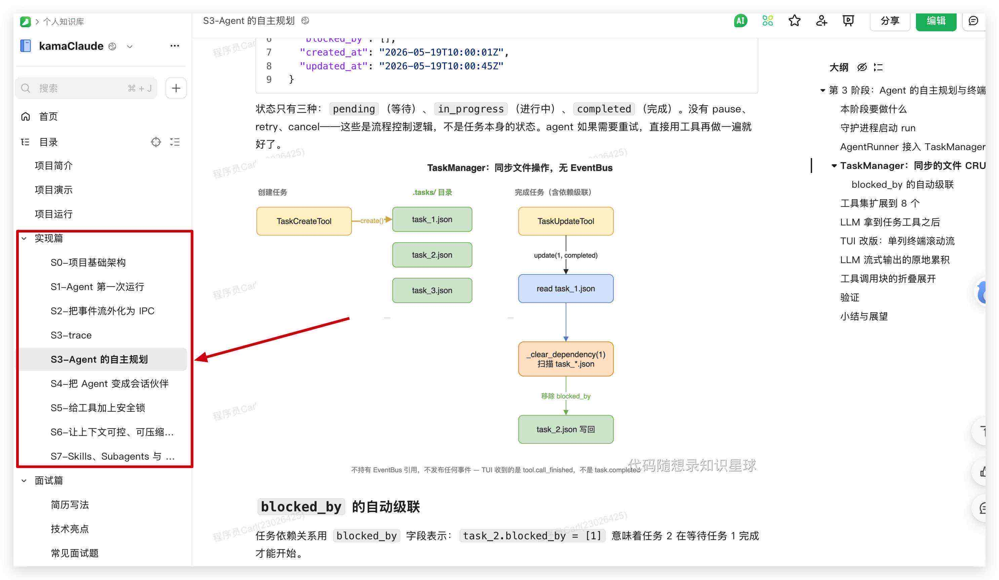

| 阶段 | 主题 | 这一阶段真正解决的问题 |
| --- | --- | --- |
| S0 | 骨架与协议契约 | CLI 和 daemon 通过真实 IPC 完成一次 ping/pong |
| S1 | Agent 最小闭环 | 一次 `kama run` 从 goal 到 LLM、工具、事件文件完整跑通 |
| S2 | 事件流外化 | AgentRunner 搬进 daemon，CLI/TUI 通过 IPC 订阅同一份事件流 |
| S3 | 自主规划与 TUI | Agent 能用任务工具拆解复杂目标，TUI 展示完整执行过程 |
| Trace | 系统级时间线 | IPC / EventBus / LLM 三层数据流可追踪、可回放 |
| S4 | 会话与记忆 | 多轮 run 进入同一个 session，thread 和 notes 接住上下文 |
| S5 | 工具安全 | 工具调用前有参数校验、权限审批、失败分类和重试 |
| S6 | 上下文治理 | 长会话下有 context 水位、tool_result 截断和 compact |
| S7 | 扩展边界 | Skills、Subagents、MCP 让 Agent 可组织、可派生、可接外部工具 |

从第一章开始，项目就不是“先写一个脚本，后面再慢慢重构”。

KamaClaude 在 S0 就先把 `kama` CLI 和 `kama-core` daemon 拆开，通过 TCP NDJSON + JSON-RPC 2.0 通信。

这一步看起来比普通脚手架更重，但它换来的是后面所有能力都不用推倒重来：

* TUI 可以复用同一套 IPC
* 事件订阅可以复用同一套通道
* 权限审批可以通过事件推到前端
* trace 可以记录完整请求和响应
* 后续 Web 前端也可以接入同一个 Core

这就是工程项目里真正值钱的地方。

不是“能不能跑”，而是系统边界一开始就立住。

### 项目架构图

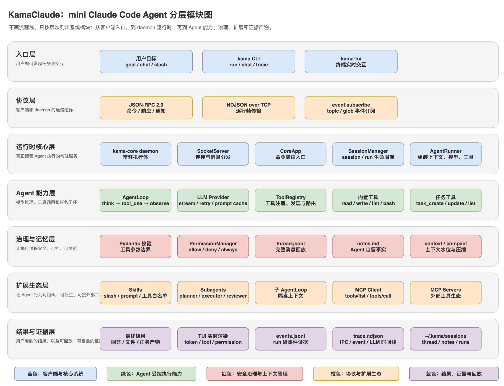

KamaClaude 的核心不是一个 prompt，而是一套完整的本地 Agent 运行链路：

```latex
用户目标
  → CLI / TUI
  → JSON-RPC over NDJSON
  → kama-core daemon
  → AgentRunner
  → AgentLoop
  → LLM Provider
  → ToolRegistry
  → PermissionManager
  → EventBus
  → Session Store
  → TUI 实时渲染 / events.jsonl 持久化 / trace 回放
```

你学完以后，面试官再问 AI Agent 项目，你就不是说：

“我调用了大模型 API。”

而是能说：

* 我实现了 ReAct AgentLoop 和工具调用闭环
* 我用 EventBus 把 Agent 执行过程外化成事件流
* 我实现了 TUI 实时渲染、工具折叠块、权限审批卡片
* 我实现了 Session、thread、notes 三层记忆体系
* 我实现了上下文水位检测、tool_result 截断、自动 compact 和手动 compact
* 我实现了 Skills、Subagents、MCP 外部工具接入
* 我用 pytest、mypy strict、ruff 保证项目质量
* 我实现了守护进程 + 多客户端架构
* 我设计了 JSON-RPC 2.0 + NDJSON 的类型化 IPC 协议

这就不是“AI 套壳项目”了。

这是一个能拿去讲系统设计、异步并发、协议建模、工具安全、上下文工程、多 Agent 编排的高质量项目。

### 项目亮点

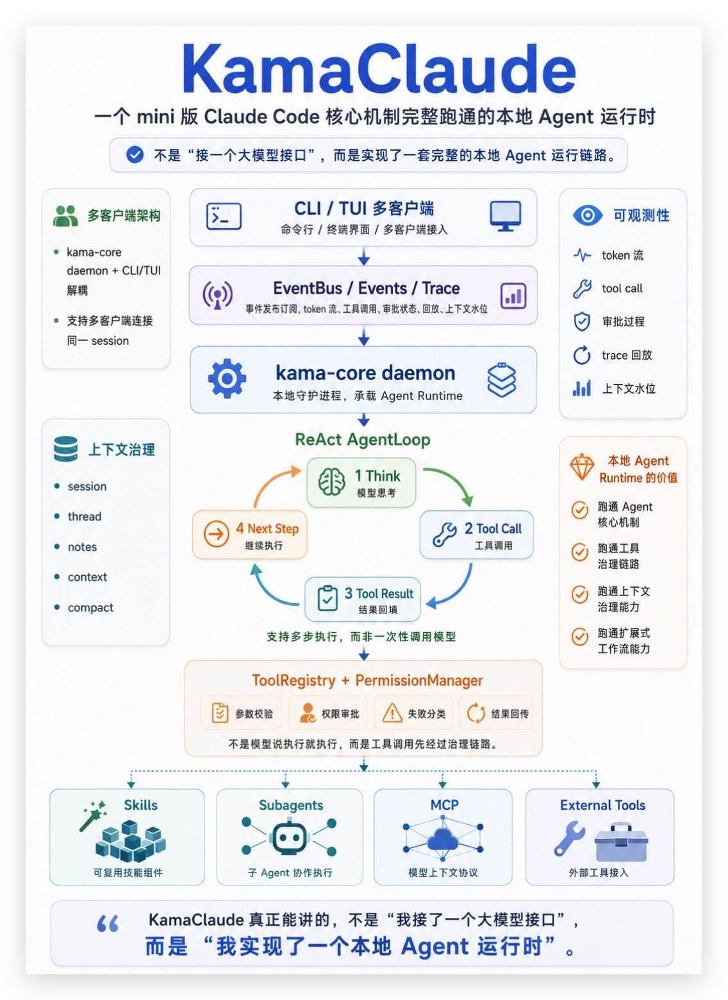

KamaClaude 最大的亮点，是把 Claude Code 这类 AI 编程 Agent 背后的核心机制，用一个 mini 版工程完整跑通：它不是单进程脚本，而是 `kama-core` daemon + CLI/TUI 多客户端架构；

不是一次性调大模型，而是 ReAct AgentLoop，支持模型思考、工具调用、结果回填和多步执行；

不是让模型说执行就执行，而是把工具调用放进 `ToolRegistry` 和 `PermissionManager`，先做参数校验、权限审批、失败分类，再把 tool result 返回给模型；

不是只展示最终答案，而是通过 `EventBus`、events、trace 和 TUI，把 token 流、工具调用、审批、上下文水位都实时展示并可回放；

不是简单拼接聊天历史，而是用 session、thread、notes、context 和 compact 做上下文治理；

最后还支持 Skills、Subagents、MCP，把工作流、子 Agent 和外部工具统一接进同一套运行链路。

也就是说，这个项目真正能讲的不是“我接了一个大模型接口”，而是“我实现了一个本地 Agent 运行时”。


### 这个项目适合谁？

如果你正在准备秋招、春招、实习、社招，想做一个 AI 项目，想了解Agent工作原理，这个项目很适合你。

如果你已经做过 RAG、聊天机器人、AI 助手，想把项目深度往 Agent 工程方向拔高，这个项目也很适合。

如果你想理解 Claude Code、Codex、Cursor 这类 AI 编程工具背后的运行时设计，这个项目同样值得系统学一遍。

它不是教你背概念。

**它是带你从 S0 到 S7，八个阶段，把一个本地 Agent 工具从零搭出来**。

每一章都有明确的执行路径，每一阶段都能运行、能验证、能留下文件证据。

你不是最后拿到一个黑盒项目。

你会知道它每一层为什么存在。

### 项目专栏

**本项目为文字专栏讲解方式，不过在项目环境配置，启动，使用上 给大家录制了视频**。

项目专栏把 简历写法、项目亮点、常见面试题 都准备好了，大家做完这个项目可以直接用。

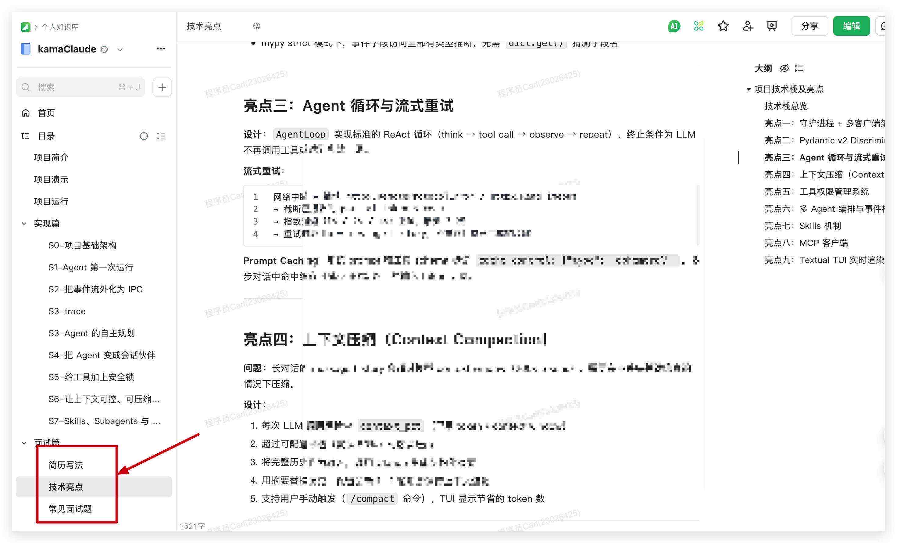

本项目分成8个阶段完成，每一阶段都有详细讲解：

S0、项目基础架构：

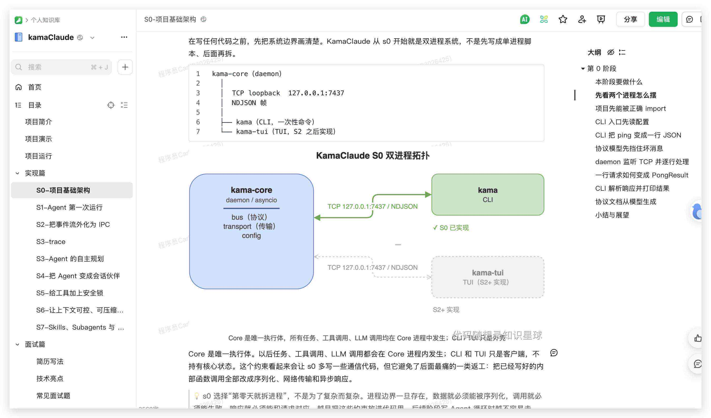

S1、Agent 第一次运行

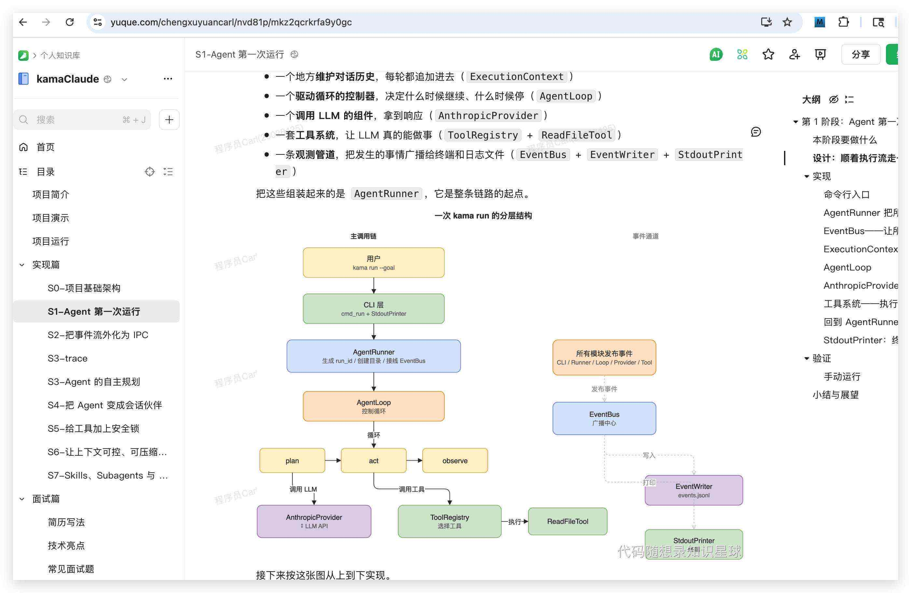

S2、把事件流外化为 IPC

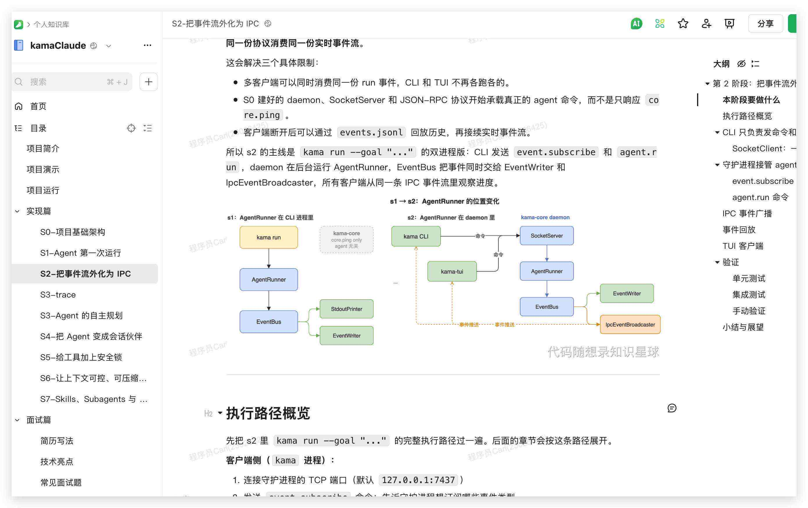

S3、trace

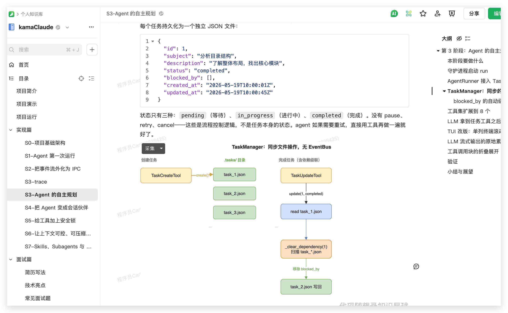

S3、Agent 的自主规划


S4、把 Agent 变成会话伙伴

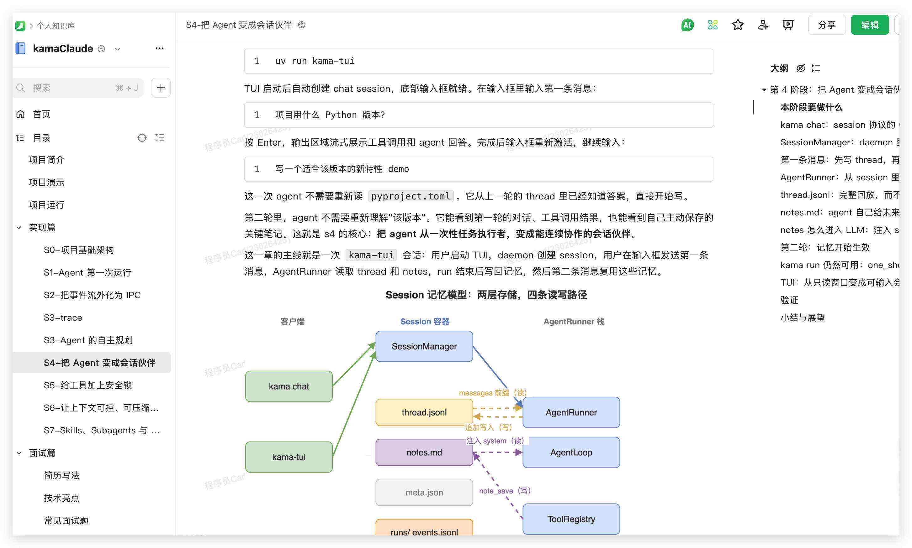

S5、给工具加上安全锁

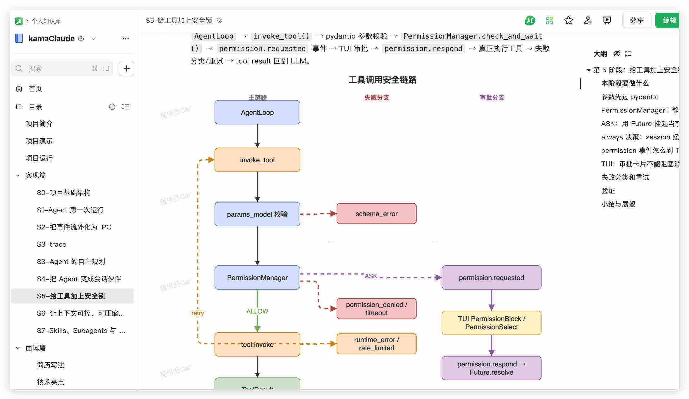


S6、让上下文可控、可压缩、可续航

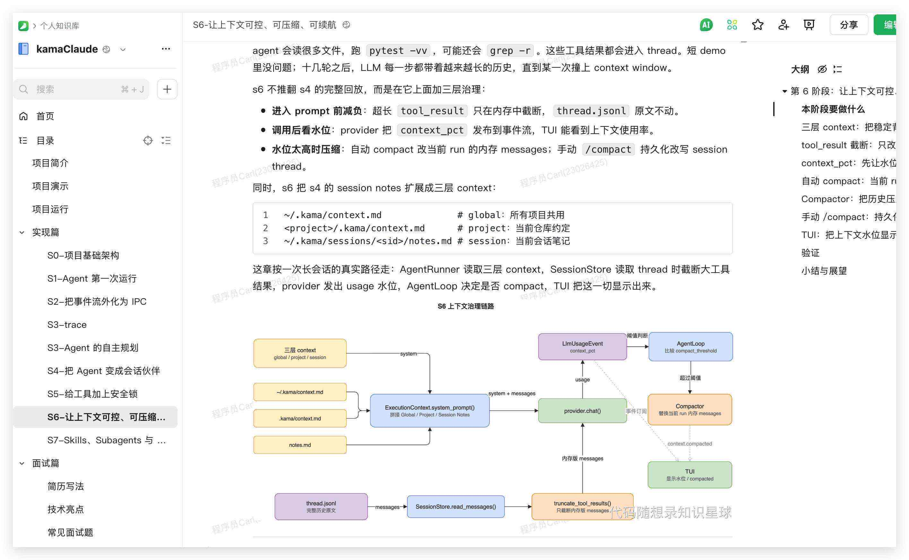

S7、Skills、Subagents 与 MCP

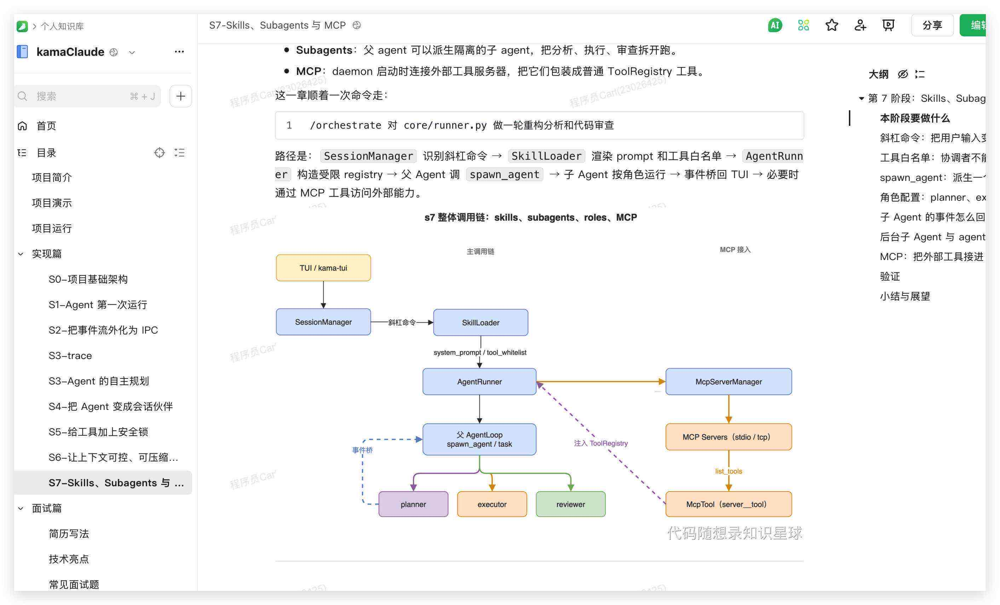


### 加入知识星球获取本项目

扫如下十元代金券，只需要 196 元，加入[知识星球](https://programmercarl.com/other/kstar.html)，你将获得 **20+ 套项目教程专栏 + 源码 + 配套答疑**。

每个项目平均不到十元钱，而且加入星球的服务远不止这些项目。

<div align="center"> </img></div>

加入知识星球后，记得加如下微信，发动付款截图，拉你到星球交流群：

<div align="center"> </img></div>


如果你不知道知识星球对自己是否有帮助，可以先加入看看，感受一下星球里的学习氛围。

**三天内（72h）可以全额退款。**

知识星球 APP 右上角自己申请退款，一个小时到账，全程无套路。

记得是三天内（72h）才能退款。

### QA

**1、这个项目有视频吗**？

项目如何配置环境，启动，部署，运行，已经功能介绍，是有视频的。

主要项目讲解为文字专栏的方式。

项目有专属答疑微信群，不懂得的地方可以在群里提问，我们都会答疑。

**2、这个项目用什么语言开发**？

Python

**3、KamaClaude项目用Python实现，有其他语言版本吗**？

实现一个Agent 关键在于Agent的原理，面试官不会问你 你用什么语言实现的Agent。

就像大家目前看到 Claude原理的文章，没有人会重点强调这是用什么语言实现的，而是强调Claude 这个agent的原理。

所以 在开发 KamaClaude，我们考虑使用python，就是因为python最容易上手。

**4、我是C++、Java、Go或者其他语言选手，能做这个项目吗**？

如果是 C++、Java、Go或者其他语言选手，做个项目没问题，这个项目写简历上，面试官也不会问你语言问题，而是聚焦Agent的设计与实现。

我们项目专栏上，简历写法，项目亮点，都不强调编程语言，都聚焦Agent原理。


